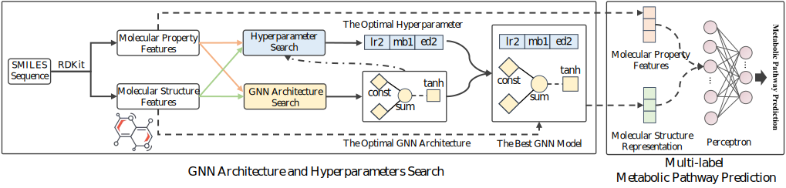

# AutoMSR

- AutoMSR is a molecular structure automatic representation learning framework for multi-label metabolic pathway prediction.

- The framework of AutoMSR is as follows:

<br>
<div align=left>  </div>


## News

- **The data preprocessing module and data set will upload soon, thank you for your waiting**.

- 2021.10.24 Our work [*Multi-label Metabolic Pathway Prediction with Auto Molecular Structure Representation Learning*](https://ieeexplore.ieee.org/abstract/document/9669309) is accepted by **BIBM 2021**.

  
## Installing For Ubuntu 16.04

- **Ensure you have installed CUDA 10.2 before installing other packages**

**1. Nvidia and CUDA 10.2:**

```python
[Nvidia Driver] 
https://www.nvidia.cn/Download/index.aspx?lang=cn

[CUDA 10.2 Download and install command] 
#download:
wget https://developer.download.nvidia.com/compute/cuda/10.2/Prod/local_installers/cuda_10.2.89_440.33.01_linux.run
#install:
sudo sh cuda_10.2.89_440.33.01_linux.run

```

**2. Python environment:** recommending using Conda package manager to install

```python
conda create -n automsr python=3.7
source activate automsr
```

**3. Pytorch 11.1.0:** execute the following command in your conda env automsr

```python
pip3 install torch torchvision torchaudio
```

**4. Pytorch Geometric:** execute the following command in your conda env automsr
```python
pip install torch-scatter torch-sparse torch-cluster torch-spline-conv torch-geometric -f https://data.pyg.org/whl/torch-1.11.0+cu102.html
```
**5. Ray:** execute the following command in your conda env automsr
```python
pip install ray
```


## Citing

If you think Auto-GNAS is useful tool for you, please cite our paper, thank you for your support:
```python
@INPROCEEDINGS{9669309,
  author={Chen, Jiamin and Gao, Jianliang and Lyu, Tengfei and Oloulade, Babatounde Moctard and Hu, Xiaohua},
  booktitle={2021 IEEE International Conference on Bioinformatics and Biomedicine (BIBM)}, 
  title={Multi-label Metabolic Pathway Prediction with Auto Molecular Structure Representation Learning}, 
  year={2021},
  volume={},
  number={},
  pages={171-176},
  doi={10.1109/BIBM52615.2021.9669309}}
```
